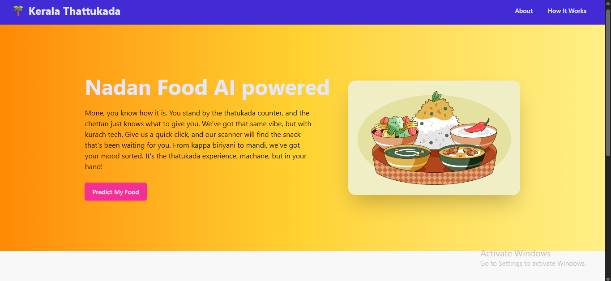
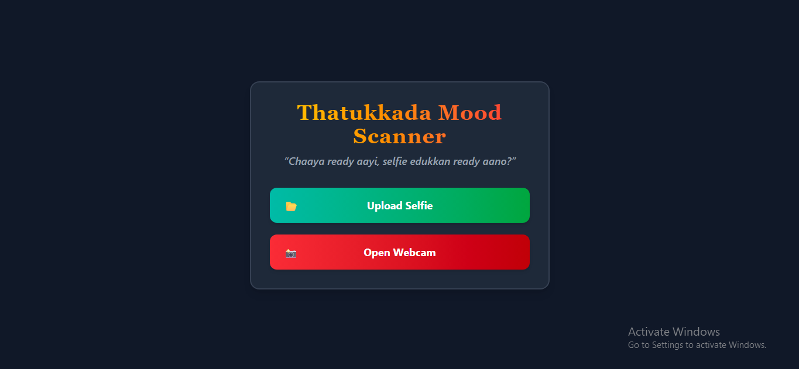
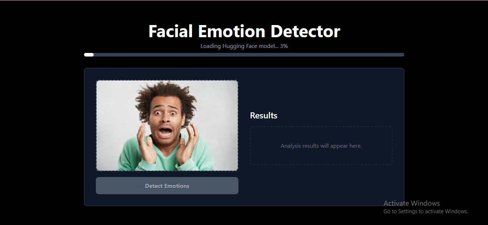
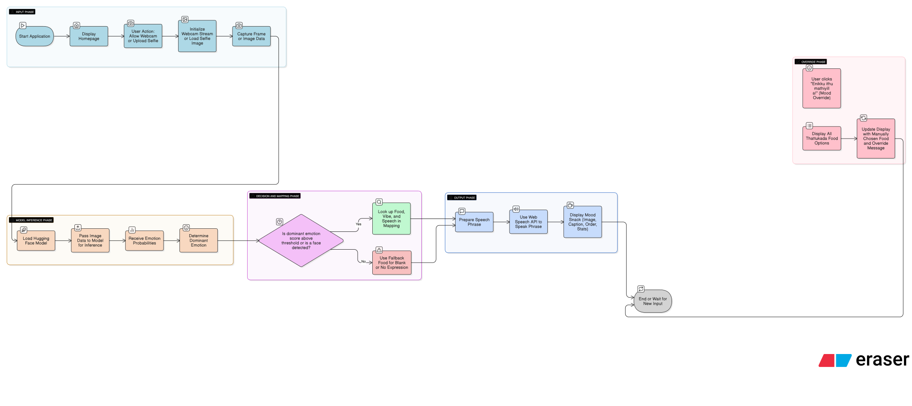

# [Project Name] 🎯

## Basic Details
### Team Name: [Attack on Snacks]

### Team Members
- Team Lead: [A S SOBHRAJ] - [GEC Sreekrishnapuram]
- Member 2: [UVAIS J] - [GEC Sreekrishnapuram]

### Project Description
[Thatukkada Mood Scanner is a quirky, Kerala-themed web app that detects your mood from a selfie using AI-powered face and emotion recognition. Based on your vibe, it serves up Text-To-Speech(TTsModel) over-the-top snack horoscopes, reincarnation predictions, and even dramatic snack death prophecies — all wrapped in a nostalgic thattukada aesthetic.]

### The Problem (that doesn't exist)
[People are walking around tragically unaware of what snack their mood truly embodies — a crisis in the making. Without proper snack-based prophecies, humanity risks eating the wrong vada at the wrong time, misinterpreting emotional chaya signals, and completely missing out on their spiritually destined thattukada fate. We’re here to fix the world’s most pointless, yet deeply urgent, snack–emotion alignment crisis.]

### The Solution (that nobody asked for)
[We built Thatukkada Mood Scanner, the only app brave enough to combine cutting-edge AI emotion detection with completely unscientific snack prophecies. Using face detection and emotion analysis, our virtual thattukada legend judge your face harder than your auntie at a wedding. Then, with the wisdom of a thousand banana fritters, we deliver your Snack Horoscope, Snack Reincarnation, and Snack Death Prediction — all accompanied by overly dramatic TTS narration, tacky animations, and background music that feels like a tea shop in 1998.]

## Technical Details
### Technologies/Components Used
For Software:
- [JavaScript (ES6+), HTML5, CSS3]
- [React.js, Tailwind CSS, DaisyUI]
- [face-api.js (face detection), Hugging Face Transformers (emotion detection), GSAP (animations), Howler.js (audio playback), Typewriter-effect (dramatic text reveal)]
- [Vite (build tool), Git/GitHub (version control), VS Code (development), JSON-based content mapping for snack dialogues]

### Implementation
For Software: 
# Installation
[
# Install backend dependencies
cd backend
npm install
# Install frontend dependencies
cd Frontend
npm install]

# Run
[
# Start backend server
cd backend
npm run start

# Start frontend server (in a new terminal)
cd frontend
npm  run dev]

### Project Documentation
For Software: Frontend
Technology
React.js — UI and component architecture

Bootstrap — Responsive styling and layout

face-api.js and Huggingface/transformers model for face and emotion detection

Fetch/Axios — API calls to backend endpoints

Main Components
MoodScanner — Captures webcam feed, detects emotion, triggers snack & horoscope display

SnackRecommendation — Displays snack matched to detected mood with description

SnackHoroscope — Shows fun horoscope text for the snack/mood

SnackReincarnation — Shows reincarnation story text

SnackDeathPrediction — Shows funny death prediction text

Backend
Technology
Node.js + Express.js — Lightweight REST API server

In-memory JSON files — Data source for snacks, horoscopes, reincarnation, death predictions 

# Screenshots (Add at least 3)

*An Intro page to guide on what all the features of this app are and what all to do*

*Main interface where you upload your selfie or use the webcam to start the mood scanning journey.*

*This is the phase where your face is detected then passed onto two models for emotion detection*

*Here goes our TTS where thatukadda karan and ammavan discuss your fate maybe even fight over it(PS-: the TTS model needs permission when you run backend and reach the result page you will se console message for backend that you need permision from API key owners so when that appears pls do contact us only then it works as it groq's policy)*

# Diagrams

*This diagram shows the entire Thatukkada Mood Scanner journey — starting from the nostalgic intro, moving to the home screen for image input, then to the dual-personality detection screen (face-api.js and Huggingface model), followed by the TTsModel’s dramatic mood reveal(dual personality Thatukadda karan and random ammavan ), and finally the snack prophecy pages powered by food_list.json*

For Hardware:

# Schematic & Circuit

*Add caption explaining connections*

*Add caption explaining the schematic*

# Build Photos

*List out all components shown*

*Explain the build steps*

*Explain the final build*

### Project Demo
# Video
[Add your demo video link here]
*Explain what the video demonstrates*

# Additional Demos
[Add any extra demo materials/links]

## Team Contributions
- [Name 1]: [Specific contributions]
- [Name 2]: [Specific contributions]
- [Name 3]: [Specific contributions]

---
Made with ❤️ at TinkerHub Useless Projects 

